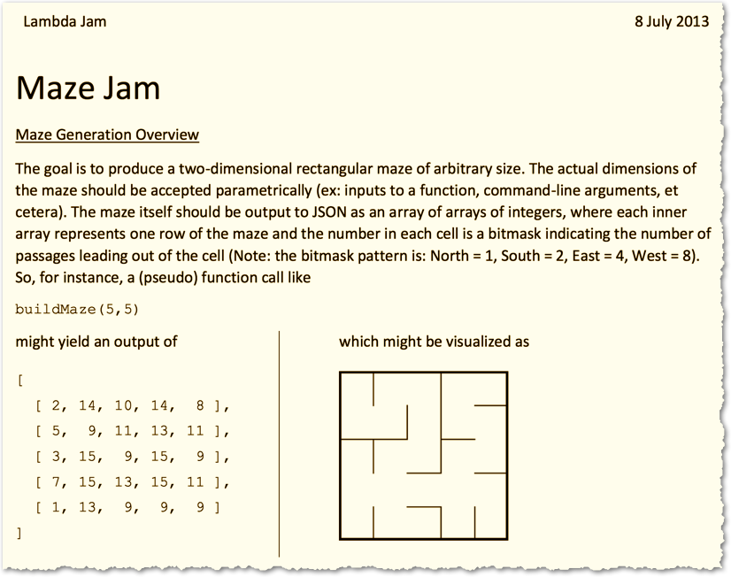
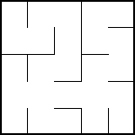

# maze-jam
A place for NashFP to share "Maze Jam" solutions

LambdaJam 2013 was an amazing event. Brilliant keynotes, brilliant talks, and each  afternoon was a choice: either attend a workshop, or a jam session. In a Jam sessions teams formed and each team worked through a coding excercise. At the end, teams could plug into the projector and show thier solutions. This event was NashFP's soul mate in conference form. Hats off to [@puredanger](https://github.com/puredanger).

One of the Jam Sessions "Maze" was led by NashFP member [Paulmichael Blasucci](https://github.com/pblasucci). 



## How to play along

From Paul's blog post "[To the A-maze-ment of All: Generating Mazes in F#](https://pblasucci.wordpress.com/2013/07/20/to-the-a-maze-ment-of-all-generating-mazes-in-f/)"

> The goal is to produce a two-dimensional rectangular maze of arbitrary size. The actual dimensions of the maze should be accepted parametrically (ex: inputs to a function, command-line arguments, et cetera). The maze itself should be output… as an array of arrays of integers, where each inner array represents one row of the maze and the number in each cell is a bitmask indicating the number of passages leading out of the cell (Note: the bitmask pattern is: North = 1, South = 2, East = 4, West = 8).

For example this code...
```
var maze = [
  [ 2, 14, 10, 14,  8 ],
  [ 5,  9, 11, 13, 11 ],
  [ 3, 15,  9, 15,  9 ],
  [ 7, 15, 13, 15, 11 ],
  [ 1, 13,  9,  9,  9 ]
]
```

... represents this maze




### Extra points 
* Mark a start and end point and guarantee one path through.
* Mark a start and end point and guarantee *exactly* one path through.


Contribute your solution by creating a directory in this repo such as bryan_hunter+elixir